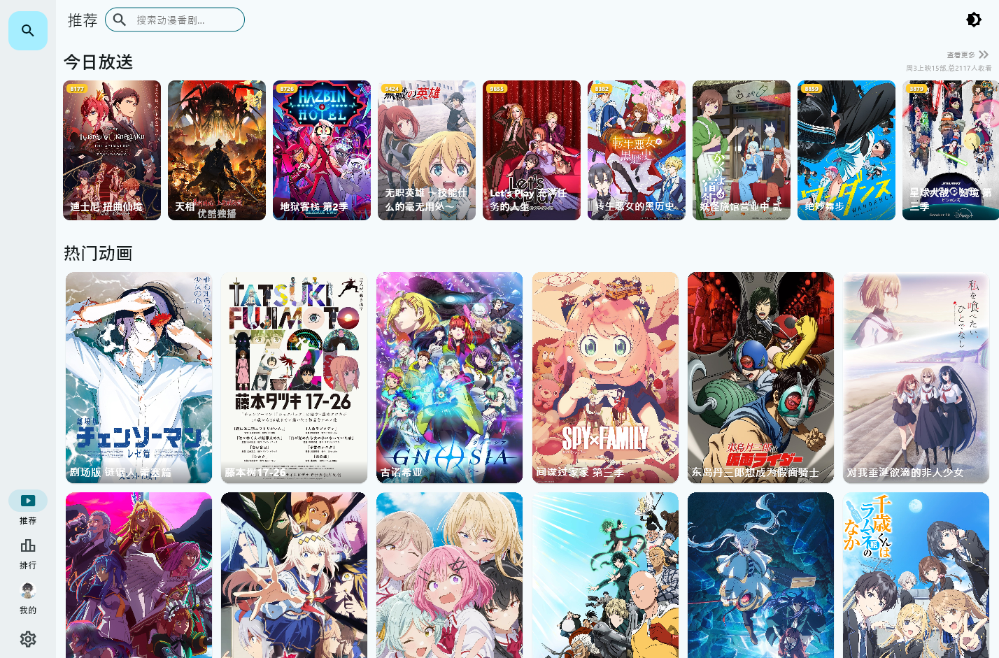
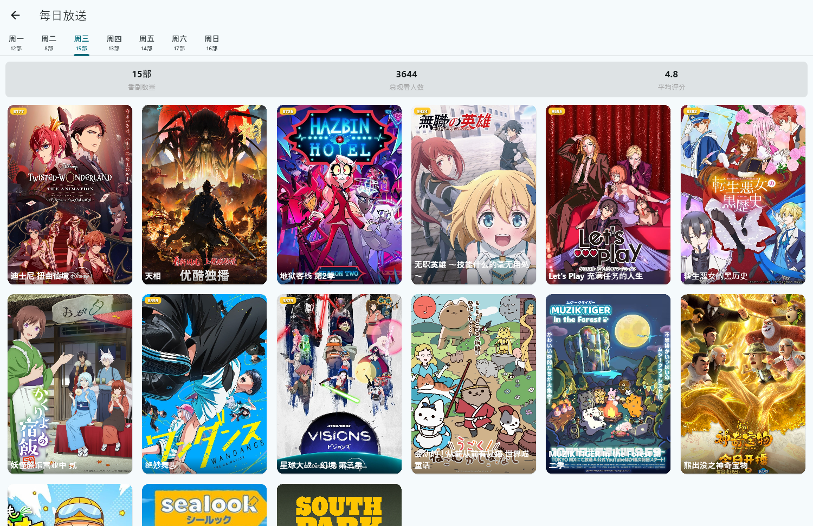
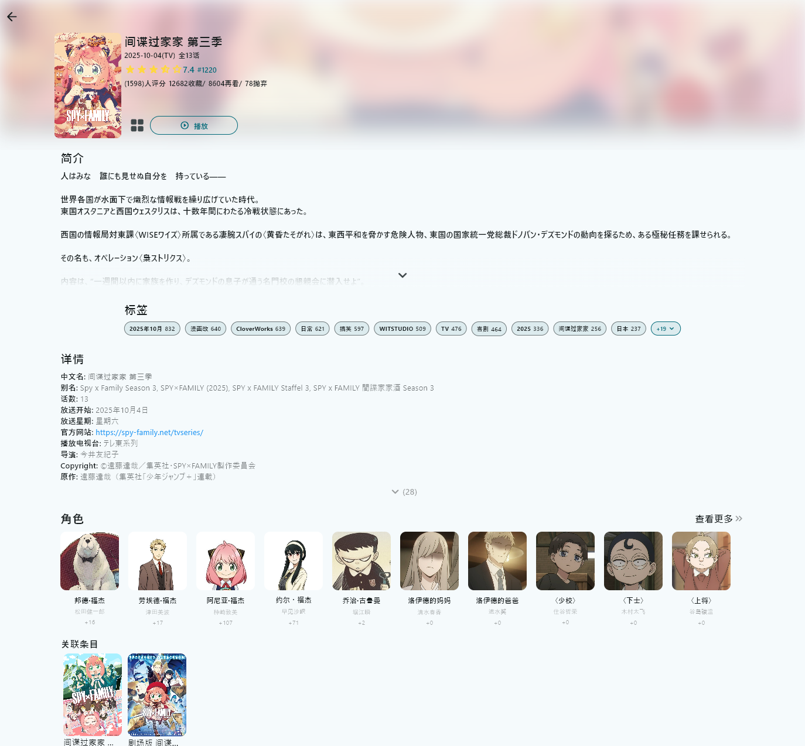
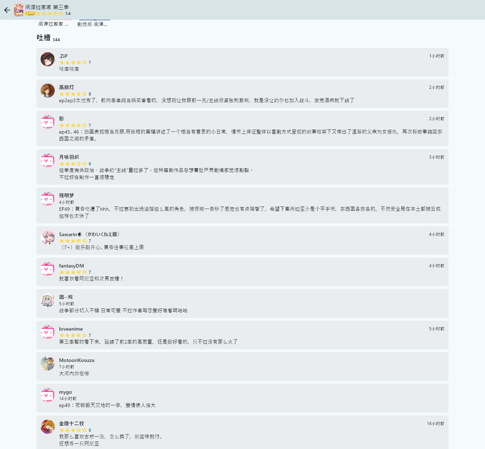
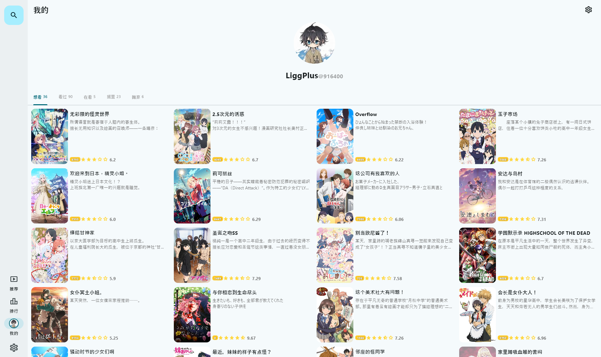
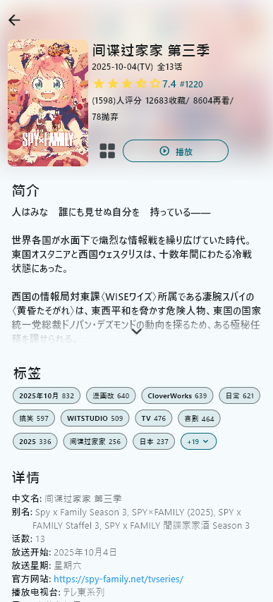
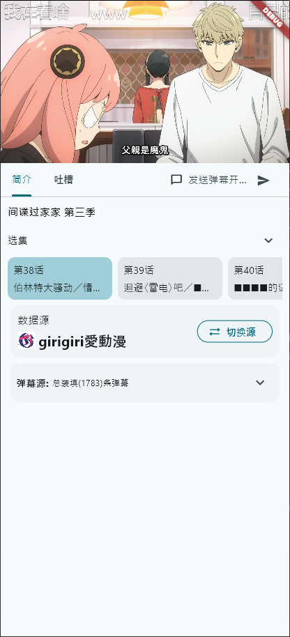
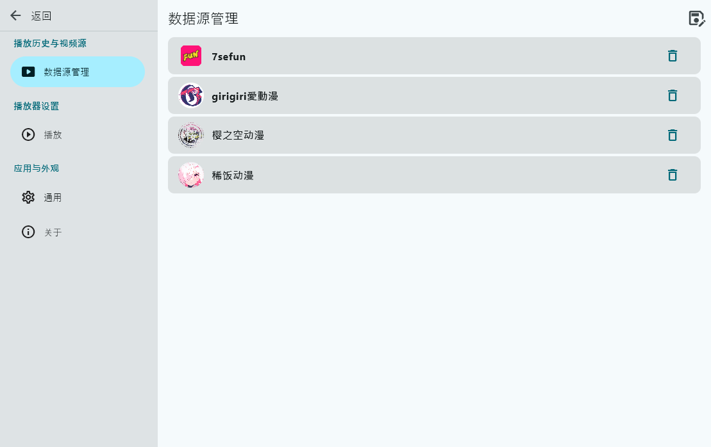
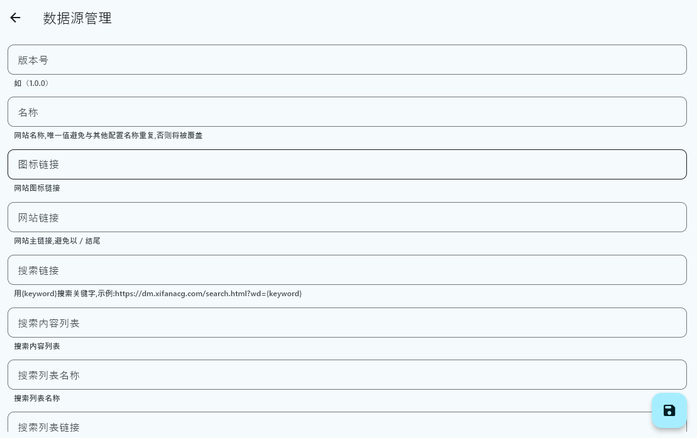
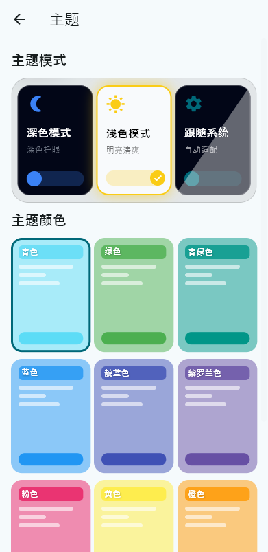

<div align="center">
  
</div>

# AnimeFlow

一个跨平台的动漫视频播放应用，支持多数据源、自定义爬虫配置,对接Bangumi服务同步用户收藏数据,为您提供流畅的观影体验。


### 📱 多平台支持
- **移动端**：Android、iOS
- **桌面端**：Windows、macOS、Linux

### ⚙️ 数据源管理
- 支持自定义数据源配置
- 灵活的数据源添加、编辑、删除
- 多数据源切换


## 🖼️ 应用截图

### 桌面端
<div align="center">
  
  
  
  
  
  
</div>

### 移动端
<div align="center">
  
  
  
  
  
  
</div>

### 数据源管理
<div align="center">
  
  
</div>

### 主题管理
<div align="center">
  
</div>


## 📦 安装与运行

### 安装步骤

1. **克隆项目**
```bash
git clone https://github.com/openAnimeFlow/AnimeFlow.git
cd AnimeFlow
```

2. **安装依赖**
```bash
flutter pub get
```

3. **配置环境变量**
创建 `.env` 文件并配置必要的环境变量:`CLIENT_ID=bgmxxx,REDIRECT_URI=bgm回调链接`

4. **运行项目**
```bash
# 运行在移动设备/模拟器
flutter run

# 运行在桌面端
flutter run -d windows  # Windows
flutter run -d macos    # macOS
flutter run -d linux    # Linux

# 运行在 Web
flutter run -d chrome
```

### 构建发布版本

```bash
# Android APK
flutter build apk --split-per-abi

# iOS
flutter build ios

# Windows
flutter build windows

# macOS
flutter build macos

# Linux
flutter build linux

# Web
flutter build web
```

### 添加数据源

1. 进入 **设置** → **数据源管理**
2. 点击右上角添加按钮
3. 填写数据源配置信息：
   - 版本号
   - 名称（唯一标识）
   - 图标链接
   - 网站链接
   - 搜索链接（使用 `{keyword}` 作为搜索关键字占位符）
   - 搜索内容列表 XPath
   - 搜索列表名称 XPath
   - 搜索列表链接 XPath
   - 线路名称 XPath
   - 剧集列表 XPath
   - 剧集链接 XPath
4. 保存配置


## 🤝 贡献

欢迎提交 Issue 和 Pull Request！

## 📄 许可证

本项目采用私有许可证，仅供学习和研究使用。

## 🙏 致谢

感谢所有为这个项目做出贡献的开发者和用户。

---

**注意**：本项目仅供学习交流使用，请遵守相关法律法规，尊重版权。
